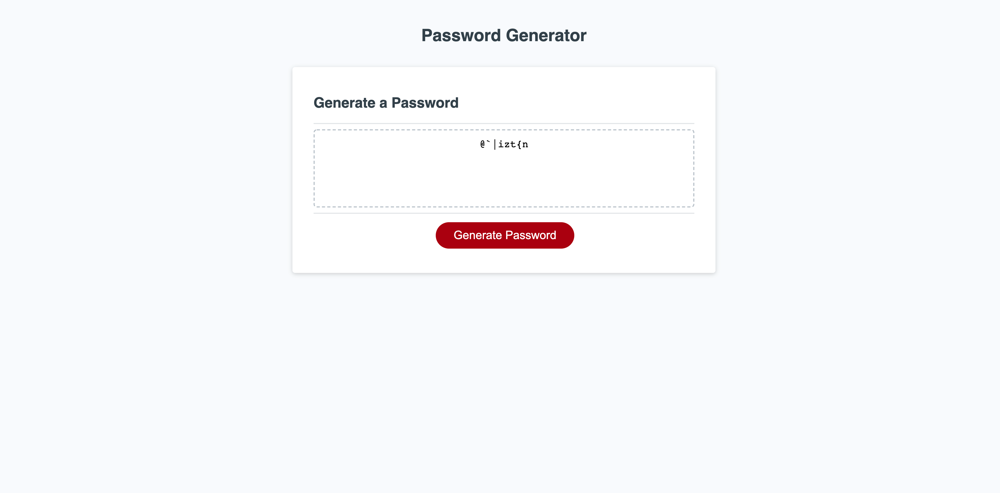

# password-generator

## Description
Create a password generator that will randomly create a password between 5 and 128 characters with options for lowercase, uppercase, numbers, and special characters. Password generator will validate the value for length and only allow a user to choose between 5 and 128 characters.

## Acceptance Criteria
AS AN employee with access to sensitive data I WANT to randomly generate a password that meets certain criteria SO THAT I can create a strong password that provides greater security

GIVEN I need a new, secure password WHEN I click the button to generate a password THEN I am presented with a series of prompts for password criteria WHEN prompted for password criteria THEN I select which criteria to include in the password WHEN prompted for the length of the password THEN I choose a length of at least 8 characters and no more than 128 characters WHEN asked for character types to include in the password THEN I confirm whether or not to include lowercase, uppercase, numeric, and/or special characters WHEN I answer each prompt THEN my input should be validated and at least one character type should be selected WHEN all prompts are answered THEN a password is generated that matches the selected criteria WHEN the password is generated THEN the password is either displayed in an alert or written to the page

## Screenshot

## Deployed link
https://chris-pietrangeli.github.io/password-generator/
